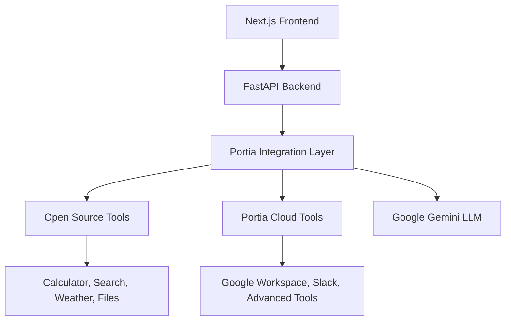

# 🚀 Nexus AI Agent - Portia Tools Integration

A powerful AI agent platform built with Next.js, featuring comprehensive integration with **80+ Portia.AI tools** including open source and cloud-based tools for enhanced AI capabilities.


## 🎯 Overview

Nexus AI is an advanced conversational AI platform that leverages Portia.AI's extensive tool ecosystem to provide users with powerful capabilities spanning web search, file processing, productivity tools, calculations, and much more.

### 🌟 Key Features

- **80+ AI Tools** - Comprehensive toolset including open source and cloud tools
- **Intelligent Tool Selection** - Smart routing between tool registries
- **Real-time Tool Discovery** - Dynamic tool loading and categorization
- **Enhanced Chat Interface** - Beautiful UI with tool usage visualization
- **Multi-Registry Support** - Open Source, Cloud, and Custom tool registries
- **Performance Monitoring** - Execution time tracking and optimization

---

## 🛠️ Tool Categories & Capabilities

### 📊 **Tool Registry Overview**

| Registry            | Tools Count  | Description                        |
| ------------------- | ------------ | ---------------------------------- |
| **Open Source**     | 10 tools     | Free, reliable, core functionality |
| **Portia Cloud**    | 70 tools     | Premium, advanced integrations     |
| **Total Available** | **80 tools** | Complete AI toolset                |

### 🔍 **Search & Web Tools**

- **Web Search** - Advanced internet search using Tavily
- **Website Crawler** - Extract structured data from websites
- **Content Extraction** - Pull specific information from web pages
- **Browser Automation** - Navigate and interact with websites

### 📁 **File Management Tools**

- **File Reader** - Read various file formats (TXT, JSON, CSV, etc.)
- **File Writer** - Create and write files programmatically
- **PDF Reader** - Extract text and data from PDF documents
- **Document Processing** - Parse and analyze document content

### 📅 **Productivity Tools (Cloud)**

- **Google Docs** - Create, read, and modify Google Documents
- **Google Drive** - Search and manage Google Drive files
- **Google Calendar** - Schedule events, check availability, manage calendar
- **Gmail** - Draft, send, and search emails
- **Slack Integration** - Send messages, list channels and users

### 🧮 **Calculation & Data Tools**

- **Calculator** - Advanced mathematical computations
- **Data Analysis** - Process and analyze datasets
- **Statistical Operations** - Perform statistical calculations
- **Unit Conversions** - Convert between different units

### 🌤️ **Information & Utility Tools**

- **Weather Tool** - Real-time weather data and forecasts
- **Map Tool** - Location services and mapping functionality
- **Image Understanding** - Analyze and describe images
- **LLM Tool** - Advanced language model capabilities

---

## 🏗️ Architecture



### 🔧 **Technology Stack**

#### Frontend

- **Next.js 14** - React framework with App Router
- **NextUI v2** - Modern React UI library
- **Tailwind CSS** - Utility-first CSS framework
- **TypeScript** - Type-safe development
- **Framer Motion** - Smooth animations

#### Backend

- **FastAPI** - High-performance Python web framework
- **Portia.AI SDK** - Tool integration and orchestration
- **Google Gemini** - Primary language model
- **Pydantic** - Data validation and serialization
- **Uvicorn** - ASGI server for production

---

## 🚀 Quick Start

### Prerequisites

- **Node.js** 18+
- **Python** 3.11+
- **Google API Key** (for Gemini)
- **Portia API Key** (for cloud tools - optional)

### 1. Clone & Install

```bash
# Clone the repository
git clone https://github.com/ADML003/Nexus_AgentHack.git
cd Nexus_AgentHack

# Install frontend dependencies
npm install

# Install backend dependencies
cd backend
pip install -r requirements.txt
```

### 2. Environment Configuration

Create `.env.local` in the project root:

```env
# Required
GOOGLE_API_KEY=your_google_gemini_api_key_here

# Optional (for cloud tools)
PORTIA_API_KEY=your_portia_api_key_here

# Additional APIs (optional)
TAVILY_API_KEY=your_tavily_search_key
OPENWEATHER_API_KEY=your_weather_api_key
```

### 3. Start the Application

```bash
# Terminal 1: Start the backend
cd backend
python main.py

# Terminal 2: Start the frontend
npm run dev
```

### 4. Access the Application

- **Frontend**: http://localhost:3000
- **Backend API**: http://localhost:8000
- **API Docs**: http://localhost:8000/docs

---

## 📋 API Reference

### Health Check

```bash
GET /health
```

Returns system status and tool availability.

### Tool Discovery

```bash
GET /tools/registries
```

Lists all available tool registries and their tools.

### Query Processing

```bash
POST /query
{
  "query": "What's the weather in Tokyo?",
  "tool_registry": "open_source"
}
```

### Tool-Specific Query

```bash
POST /tool-query
{
  "query": "Calculate compound interest",
  "tool_id": "calculator_tool"
}
```

---

## 🎮 Usage Examples

### 💡 **Smart Queries**

```bash
# Web Search
"Search for the latest developments in AI agents"

# Weather Information
"What's the current weather in London and Paris?"

# File Operations
"Read the contents of data.csv and summarize the key insights"

# Calculations
"Calculate a 15% tip on a $127.50 restaurant bill"

# Google Workspace (Cloud Tools)
"Create a Google Doc with meeting notes from our discussion"

# Slack Integration (Cloud Tools)
"Send a message to the team channel about project updates"
```

### 🔧 **Tool-Specific Usage**

Users can select specific tools for targeted tasks:

- **Calculator Tool** - For precise mathematical operations
- **Search Tool** - For comprehensive web research
- **Weather Tool** - For location-based weather data
- **Google Docs Tool** - For document creation and editing
- **Gmail Tool** - For email management and communication

---

## 🏁 Advanced Features

### 🎯 **Intelligent Tool Selection**

The system automatically selects the most appropriate tools based on the query context, but users can also manually specify tool registries.

### ⚡ **Performance Optimization**

- Async processing for concurrent tool execution
- Intelligent caching for repeated queries
- Connection pooling for external APIs
- Response streaming for large outputs

### 🔐 **Security & Privacy**

- API key encryption and secure storage
- Request validation and sanitization
- Rate limiting and usage monitoring
- Secure tool isolation

### 📈 **Monitoring & Analytics**

- Real-time execution time tracking
- Tool usage analytics and insights
- Error monitoring and alerting
- Performance metrics dashboard

---

## 📂 Project Structure

```
nexus/
├── 🎨 Frontend (Next.js)
│   ├── app/
│   │   ├── agent/              # Main AI agent interface
│   │   ├── about/              # About page
│   │   ├── docs/               # Documentation
│   │   └── layout.tsx          # Root layout
│   ├── components/
│   │   ├── ai-automation-tool.tsx
│   │   ├── navbar.tsx
│   │   └── icons/              # Icon components
│   └── lib/
│       └── api.ts              # API client
│
├── 🔧 Backend (FastAPI + Portia)
│   ├── main.py                 # Main server application
│   ├── routers/                # API route handlers
│   ├── services/               # Business logic services
│   └── requirements.txt        # Python dependencies
│
├── 📝 Configuration
│   ├── .env.local             # Environment variables
│   ├── next.config.js         # Next.js configuration
│   ├── tailwind.config.js     # Tailwind CSS config
│   └── tsconfig.json          # TypeScript configuration
│
└── 📋 Documentation
    ├── README.md              # This file
    └── backend/API_INFO.md    # API documentation
```

---

## 🛡️ Troubleshooting

### Common Issues

#### Backend Not Starting

```bash
# Check Python dependencies
pip install -r requirements.txt

# Verify API keys in .env.local
cat .env.local | grep API_KEY
```

#### Tools Not Loading

```bash
# Test Portia connection
python -c "from portia import open_source_tool_registry; print(len(open_source_tool_registry.get_tools()))"
```

#### Frontend Connection Issues

```bash
# Check backend status
curl http://localhost:8000/health

# Verify CORS configuration in main.py
```

### Performance Tips

1. **Use Open Source Tools** for reliable, fast responses
2. **Enable Cloud Tools** only when advanced features are needed
3. **Monitor API quotas** to avoid rate limiting
4. **Cache frequent queries** to improve response times

---

## 🤝 Contributing

We welcome contributions! Here's how to get started:

### Development Setup

```bash
# Fork the repository
git clone your-fork-url
cd Nexus_AgentHack

# Create feature branch
git checkout -b feature/amazing-feature

# Make changes and test
npm run test
python -m pytest backend/tests/

# Submit pull request
git push origin feature/amazing-feature
```

### Code Style

- **Frontend**: ESLint + Prettier configuration
- **Backend**: Black formatter + isort imports
- **Commits**: Conventional commit messages

---

## 📜 License

This project is licensed under the MIT License - see the [LICENSE](LICENSE) file for details.

---

## 🙏 Acknowledgments

- **Portia.AI** - For providing the comprehensive tool ecosystem
- **Google** - For Gemini API access and capabilities
- **NextUI** - For the beautiful React component library
- **Vercel** - For Next.js framework and deployment platform

---

## 📞 Support & Contact

- **GitHub Issues**: [Report bugs or request features](https://github.com/ADML003/Nexus_AgentHack/issues)
- **Documentation**: [Comprehensive docs and guides](https://github.com/ADML003/Nexus_AgentHack/wiki)
- **Community**: [Join our discussions](https://github.com/ADML003/Nexus_AgentHack/discussions)

---

<div align="center">

### 🌟 Star this repository if you find it helpful!

**Made with ❤️ by the Nexus AI Team**


</div>
